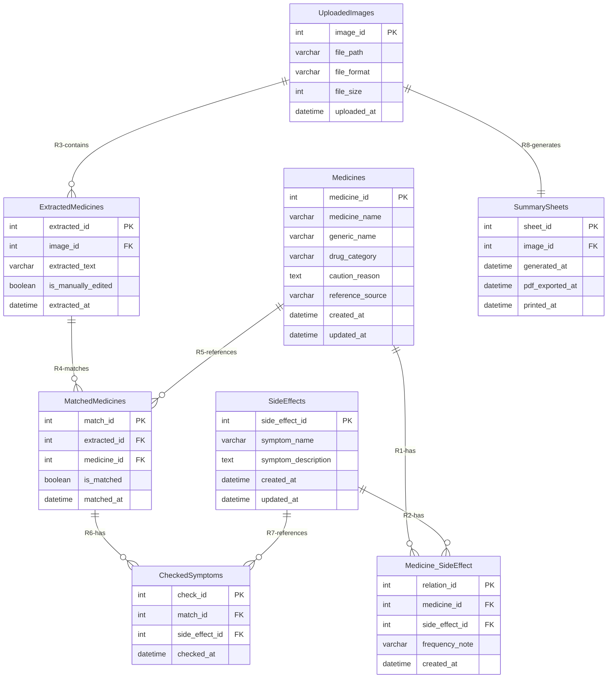
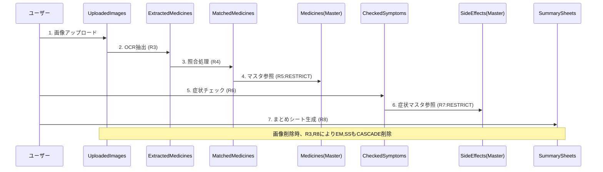
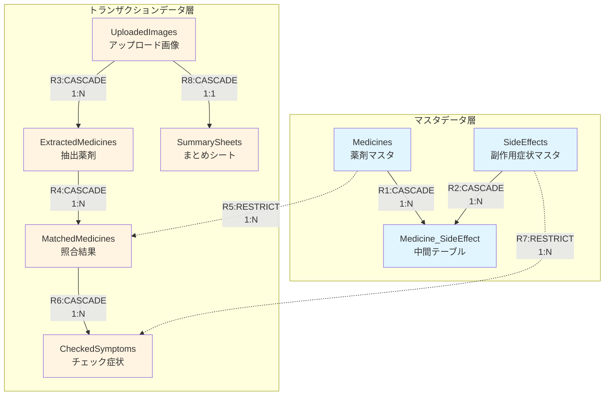

# ER図（Entity-Relationship Diagram）

**プロジェクト**: 患者参加型・薬の安全チェックアプリ  
**作成日**: 2026-01-24  
**バージョン**: 1.0  
**設計評価**: ⭐⭐⭐⭐ (85/100)

---

## 📊 完全なER図



### 📝 ER図の補足説明

**属性の詳細**は以下の「エンティティ属性一覧表」を参照してください。Mermaid記法の制約により、型のサイズやNULL許容などの詳細情報は図には含まれていません。

---

## 📋 エンティティ属性一覧表

### マスタデータ層

#### Medicines（薬剤マスタ）

| カラム名 | 型 | 制約 | 説明 |
|---------|-----|------|------|
| medicine_id | INTEGER | PK, NOT NULL | 主キー（自動採番） |
| medicine_name | VARCHAR(200) | NOT NULL | 薬剤名（商品名） |
| generic_name | VARCHAR(200) | NOT NULL | 一般名（成分名） |
| drug_category | VARCHAR(100) | NOT NULL | 薬効分類 |
| caution_reason | TEXT | NULL | 注意理由（簡潔に） |
| reference_source | VARCHAR(200) | NULL | 参照元（ガイドライン名） |
| created_at | DATETIME | NOT NULL | 登録日時 |
| updated_at | DATETIME | NOT NULL | 更新日時 |

#### SideEffects（副作用症状マスタ）

| カラム名 | 型 | 制約 | 説明 |
|---------|-----|------|------|
| side_effect_id | INTEGER | PK, NOT NULL | 主キー（自動採番） |
| symptom_name | VARCHAR(100) | NOT NULL | 副作用症状名 |
| symptom_description | TEXT | NULL | 症状の説明（平易な日本語） |
| created_at | DATETIME | NOT NULL | 登録日時 |
| updated_at | DATETIME | NOT NULL | 更新日時 |

#### Medicine_SideEffect（薬剤-副作用関連マスタ）

| カラム名 | 型 | 制約 | 説明 |
|---------|-----|------|------|
| relation_id | INTEGER | PK, NOT NULL | 主キー（自動採番） |
| medicine_id | INTEGER | FK, NOT NULL | 外部キー → Medicines |
| side_effect_id | INTEGER | FK, NOT NULL | 外部キー → SideEffects |
| frequency_note | VARCHAR(50) | NULL | 頻度メモ（例: よくある、まれ） |
| created_at | DATETIME | NOT NULL | 登録日時 |

**複合UNIQUE制約**: `UNIQUE(medicine_id, side_effect_id)`

---

### トランザクションデータ層

#### UploadedImages（アップロード画像）

| カラム名 | 型 | 制約 | 説明 |
|---------|-----|------|------|
| image_id | INTEGER | PK, NOT NULL | 主キー（自動採番） |
| file_path | VARCHAR(500) | NOT NULL | 画像ファイルのパス |
| file_format | VARCHAR(10) | NOT NULL | ファイル形式（JPEG, PNG） |
| file_size | INTEGER | NOT NULL | ファイルサイズ（バイト） |
| uploaded_at | DATETIME | NOT NULL | アップロード日時 |

#### ExtractedMedicines（抽出薬剤）

| カラム名 | 型 | 制約 | 説明 |
|---------|-----|------|------|
| extracted_id | INTEGER | PK, NOT NULL | 主キー（自動採番） |
| image_id | INTEGER | FK, NOT NULL | 外部キー → UploadedImages |
| extracted_text | VARCHAR(200) | NOT NULL | OCRで抽出された薬剤名 |
| is_manually_edited | BOOLEAN | NOT NULL | 手動修正フラグ（default: false） |
| extracted_at | DATETIME | NOT NULL | 抽出日時 |

#### MatchedMedicines（該当薬剤照合結果）

| カラム名 | 型 | 制約 | 説明 |
|---------|-----|------|------|
| match_id | INTEGER | PK, NOT NULL | 主キー（自動採番） |
| extracted_id | INTEGER | FK, NOT NULL | 外部キー → ExtractedMedicines |
| medicine_id | INTEGER | FK, NULL | 外部キー → Medicines（NULL許容） |
| is_matched | BOOLEAN | NOT NULL | 該当フラグ（true: 該当, false: 非該当） |
| matched_at | DATETIME | NOT NULL | 照合日時 |

**重要**: `is_matched=false` かつ `medicine_id=NULL` のレコードは「照合処理は完了したが、注意薬剤リストに該当しなかった」ことを表します。

#### CheckedSymptoms（チェック症状）

| カラム名 | 型 | 制約 | 説明 |
|---------|-----|------|------|
| check_id | INTEGER | PK, NOT NULL | 主キー（自動採番） |
| match_id | INTEGER | FK, NOT NULL | 外部キー → MatchedMedicines |
| side_effect_id | INTEGER | FK, NOT NULL | 外部キー → SideEffects |
| checked_at | DATETIME | NOT NULL | チェック日時 |

**複合UNIQUE制約**: `UNIQUE(match_id, side_effect_id)`

#### SummarySheets（症状まとめシート）

| カラム名 | 型 | 制約 | 説明 |
|---------|-----|------|------|
| sheet_id | INTEGER | PK, NOT NULL | 主キー（自動採番） |
| image_id | INTEGER | FK, UNIQUE, NOT NULL | 外部キー → UploadedImages（UNIQUE） |
| generated_at | DATETIME | NOT NULL | シート生成日時 |
| pdf_exported_at | DATETIME | NULL | PDF出力日時 |
| printed_at | DATETIME | NULL | 印刷実行日時 |

**UNIQUE制約**: `UNIQUE(image_id)` でMVP版では1画像につき1シートを強制

---

## 📐 ER図の凡例

### リレーションシップの記号

| Mermaid記法 | 意味 | 使用箇所 |
|------------|------|---------|
| `||--||` | 1対1（厳密） | R8: UploadedImages ⇔ SummarySheets |
| `||--o{` | 1対多（0個以上） | R1, R2, R3, R4, R5, R6, R7 |
| `}o--o{` | 多対多 | Medicines ⇔ SideEffects（中間テーブル経由） |

### カラム記法

| 表記 | 意味 |
|------|------|
| `PK` | Primary Key（主キー） |
| `FK` | Foreign Key（外部キー） |
| `int` | INTEGER型 |
| `varchar` | 可変長文字列型 |
| `text` | テキスト型 |
| `datetime` | 日時型 |
| `boolean` | 真偽値型 |

**注意**: 詳細な型情報（サイズ、NULL許容、UNIQUE制約など）は上記の「エンティティ属性一覧表」を参照してください。

---

## 📊 エンティティ統計情報

### エンティティ数

| 分類 | エンティティ数 | エンティティ名 |
|------|:-------------:|--------------|
| マスタデータ | 3 | Medicines, SideEffects, Medicine_SideEffect |
| トランザクションデータ | 5 | UploadedImages, ExtractedMedicines, MatchedMedicines, CheckedSymptoms, SummarySheets |
| **MVP版 合計** | **8** | - |

### リレーションシップ数

| 種類 | 件数 | リレーションID |
|------|:----:|--------------|
| 1対1 | 1 | R8 |
| 1対多 | 7 | R1, R2, R3, R4, R5, R6, R7 |
| 多対多 | 1 | Medicines ⇔ SideEffects（中間テーブル経由） |
| **合計** | **8** | - |

### 削除制約の分布

| 削除制約 | 件数 | 割合 | リレーションID |
|---------|:----:|:----:|--------------|
| CASCADE | 6 | 75% | R1, R2, R3, R4, R6, R8 |
| RESTRICT | 2 | 25% | R5, R7 |
| **合計** | **8** | **100%** | - |

---

## 🔗 リレーションシップ詳細一覧

| ID | 親エンティティ | 子エンティティ | 関係 | 外部キー | 削除制約 | 更新制約 | NULL許容 | カーディナリティ |
|:--:|------------|------------|:---:|---------|---------|---------|:-------:|:---------------:|
| R1 | Medicines | Medicine_SideEffect | 1:N | medicine_id | CASCADE | CASCADE | ❌ | 1〜20 |
| R2 | SideEffects | Medicine_SideEffect | 1:N | side_effect_id | CASCADE | CASCADE | ❌ | 1〜50 |
| R3 | UploadedImages | ExtractedMedicines | 1:N | image_id | CASCADE | CASCADE | ❌ | 0〜20 |
| R4 | ExtractedMedicines | MatchedMedicines | 1:N | extracted_id | CASCADE | CASCADE | ❌ | 1〜5 |
| R5 | Medicines | MatchedMedicines | 1:N | medicine_id | RESTRICT | CASCADE | ✅ | 0〜∞ |
| R6 | MatchedMedicines | CheckedSymptoms | 1:N | match_id | CASCADE | CASCADE | ❌ | 0〜10 |
| R7 | SideEffects | CheckedSymptoms | 1:N | side_effect_id | RESTRICT | CASCADE | ❌ | 0〜∞ |
| R8 | UploadedImages | SummarySheets | 1:1 | image_id | CASCADE | CASCADE | ❌ | 1 |

---

## 🎯 各リレーションシップの詳細

### R1: Medicines → Medicine_SideEffect（1対多）

**概要**: 1つの薬剤は複数の副作用と関連付けられる

**SQL定義**:
```sql
FOREIGN KEY (medicine_id) 
  REFERENCES Medicines(medicine_id)
  ON DELETE CASCADE
  ON UPDATE CASCADE
```

**仕様**:
- **カーディナリティ**: 1薬剤あたり1〜20副作用（想定）
- **削除制約**: CASCADE（薬剤削除時、関連も自動削除）
- **ビジネスルール**: 管理者のみマスタ削除可能

---

### R2: SideEffects → Medicine_SideEffect（1対多）

**概要**: 1つの副作用症状は複数の薬剤と関連付けられる

**SQL定義**:
```sql
FOREIGN KEY (side_effect_id) 
  REFERENCES SideEffects(side_effect_id)
  ON DELETE CASCADE
  ON UPDATE CASCADE
```

**仕様**:
- **カーディナリティ**: 1副作用あたり1〜50薬剤（想定）
- **削除制約**: CASCADE（副作用削除時、関連も自動削除）
- **ビジネスルール**: 管理者のみマスタ削除可能

---

### R3: UploadedImages → ExtractedMedicines（1対多）

**概要**: 1つの画像から複数の薬剤名が抽出される

**SQL定義**:
```sql
FOREIGN KEY (image_id) 
  REFERENCES UploadedImages(image_id)
  ON DELETE CASCADE
  ON UPDATE CASCADE
```

**仕様**:
- **カーディナリティ**: 1画像あたり0〜20抽出結果（想定）
- **削除制約**: CASCADE（画像削除時、抽出結果も全削除）
- **ビジネスルール**: 
  - 削除時に確認ダイアログ表示
  - 「この画像と関連する全ての結果が削除されます」と警告

---

### R4: ExtractedMedicines → MatchedMedicines（1対多）

**概要**: 1つの抽出薬剤が複数の注意薬剤マスタと照合される

**SQL定義**:
```sql
FOREIGN KEY (extracted_id) 
  REFERENCES ExtractedMedicines(extracted_id)
  ON DELETE CASCADE
  ON UPDATE CASCADE
```

**仕様**:
- **カーディナリティ**: 1抽出あたり1〜5照合結果
- **削除制約**: CASCADE（抽出削除時、照合結果も全削除）
- **ビジネスルール**: 
  - 部分一致で複数マッチの可能性あり
  - 該当なしの場合もレコード作成（is_matched=false）

**照合例**:
```
抽出薬剤: "ロキソニン"
  → マッチ1: "ロキソニン錠60mg" (is_matched=true)
  → マッチ2: "ロキソニンテープ100mg" (is_matched=true)
  → マッチ3: "ロキソプロフェンNa" (is_matched=true)
```

---

### R5: Medicines → MatchedMedicines（1対多）

**概要**: 1つの薬剤マスタが複数の照合結果で参照される

**SQL定義**:
```sql
FOREIGN KEY (medicine_id) 
  REFERENCES Medicines(medicine_id)
  ON DELETE RESTRICT
  ON UPDATE CASCADE
```

**仕様**:
- **カーディナリティ**: 1薬剤マスタあたり0〜多数の照合結果
- **NULL許容**: medicine_idはNULL許容（is_matched=falseの場合）
- **削除制約**: RESTRICT（参照中のマスタは削除不可）
- **ビジネスルール**: 
  - 薬剤マスタ削除時、参照チェックを実施
  - 参照されている場合はエラーメッセージ表示

**重要**: `is_matched=false` かつ `medicine_id=NULL` のレコードは「照合処理は完了したが、注意薬剤リストに該当しなかった」ことを表す。

---

### R6: MatchedMedicines → CheckedSymptoms（1対多）

**概要**: 1つの該当薬剤に対して、ユーザーが複数の症状をチェックする

**SQL定義**:
```sql
FOREIGN KEY (match_id) 
  REFERENCES MatchedMedicines(match_id)
  ON DELETE CASCADE
  ON UPDATE CASCADE
```

**仕様**:
- **カーディナリティ**: 1照合結果あたり0〜10チェック症状（想定）
- **削除制約**: CASCADE（照合結果削除時、チェックも全削除）
- **複合UNIQUE制約**: `UNIQUE(match_id, side_effect_id)`
- **ビジネスルール**: 
  - チェックボックスで複数選択可能
  - 同じ症状の重複チェック不可

---

### R7: SideEffects → CheckedSymptoms（1対多）

**概要**: 1つの副作用症状マスタが複数のチェック症状で参照される

**SQL定義**:
```sql
FOREIGN KEY (side_effect_id) 
  REFERENCES SideEffects(side_effect_id)
  ON DELETE RESTRICT
  ON UPDATE CASCADE
```

**仕様**:
- **カーディナリティ**: 1副作用マスタあたり0〜多数のチェック
- **削除制約**: RESTRICT（チェック履歴がある場合は削除不可）
- **ビジネスルール**: 
  - 履歴保護のため参照中は削除不可
  - 論理削除（is_deleted フラグ）の検討も可（Phase 2）

---

### R8: UploadedImages → SummarySheets（1対1）

**概要**: 1つの画像に対して1つのまとめシートを生成（MVP版）

**SQL定義**:
```sql
FOREIGN KEY (image_id) 
  REFERENCES UploadedImages(image_id)
  ON DELETE CASCADE
  ON UPDATE CASCADE
```

**仕様**:
- **カーディナリティ**: 1画像につき1シート（MVP版）
- **削除制約**: CASCADE（画像削除時、シートも削除）
- **UNIQUE制約**: `UNIQUE(image_id)` で1対1を強制
- **ビジネスルール**: 
  - MVP版: 最新のチェック結果のみ保持
  - Phase 2: 1対多に変更し履歴管理

---

## 🔒 複合ユニーク制約

### 実装が必要な複合制約

| テーブル | カラム組み合わせ | 目的 | 制約名 |
|---------|----------------|------|--------|
| Medicine_SideEffect | (medicine_id, side_effect_id) | 同じ薬剤-副作用の組み合わせの重複防止 | uk_medicine_side_effect |
| CheckedSymptoms | (match_id, side_effect_id) | 同じ照合結果に対する症状の重複チェック防止 | uk_checked_symptoms |
| SummarySheets | (image_id) | 1画像につき1シート（MVP版） | uk_summary_sheets_image |

**実装SQL**:
```sql
-- Medicine_SideEffect
CREATE UNIQUE INDEX uk_medicine_side_effect 
  ON Medicine_SideEffect(medicine_id, side_effect_id);

-- CheckedSymptoms
CREATE UNIQUE INDEX uk_checked_symptoms 
  ON CheckedSymptoms(match_id, side_effect_id);

-- SummarySheets
CREATE UNIQUE INDEX uk_summary_sheets_image 
  ON SummarySheets(image_id);
```

---

## 🔄 データフロー図



---

## 📈 階層構造図



**凡例**:
- 🔵 **青色**: マスタデータ
- 🟡 **黄色**: トランザクションデータ
- **実線**: CASCADE（連鎖削除）
- **点線**: RESTRICT（削除制限）

---

## 🎯 削除制約の動作例

### CASCADE（連鎖削除）の例

**シナリオ**: ユーザーが画像を削除

```sql
-- 画像を削除すると...
DELETE FROM UploadedImages WHERE image_id = 1;

-- 自動的に以下が削除される（CASCADE）:
DELETE FROM ExtractedMedicines WHERE image_id = 1;       -- R3
DELETE FROM MatchedMedicines WHERE extracted_id IN (...); -- R4
DELETE FROM CheckedSymptoms WHERE match_id IN (...);      -- R6
DELETE FROM SummarySheets WHERE image_id = 1;            -- R8
```

**影響範囲確認SQL**:
```sql
SELECT 
  COUNT(DISTINCT em.extracted_id) AS extracted_count,
  COUNT(DISTINCT mm.match_id) AS matched_count,
  COUNT(DISTINCT cs.check_id) AS checked_count
FROM UploadedImages ui
LEFT JOIN ExtractedMedicines em ON ui.image_id = em.image_id
LEFT JOIN MatchedMedicines mm ON em.extracted_id = mm.extracted_id
LEFT JOIN CheckedSymptoms cs ON mm.match_id = cs.match_id
WHERE ui.image_id = 1;
```

---

### RESTRICT（削除制限）の例

**シナリオ**: 参照されている薬剤マスタを削除しようとする

```sql
-- 参照されている薬剤マスタを削除しようとすると...
DELETE FROM Medicines WHERE medicine_id = 10;

-- エラーが発生:
-- ERROR: FOREIGN KEY constraint failed
-- 理由: MatchedMedicinesで参照中 (R5:RESTRICT)
```

**削除前チェックSQL**:
```sql
-- 参照件数確認
SELECT COUNT(*) AS reference_count
FROM MatchedMedicines
WHERE medicine_id = 10;

-- 結果が0より大きい場合、削除不可
```

---

## ✅ 設計レビュー結果

### 総合評価: **85/100** ⭐⭐⭐⭐

| 項目 | スコア | 評価 |
|------|:-----:|------|
| エンティティ設計 | 20/20 | 優秀 |
| リレーションシップ設計 | 18/20 | 良好（軽微な改善点あり） |
| 制約設計 | 17/20 | 良好（追加検討推奨） |
| 正規化 | 10/10 | 完璧 |
| 命名規則 | 10/10 | 完璧 |
| ドキュメント化 | 10/20 | 改善推奨 |
| **合計** | **85/100** | **優秀** |

---

### 🟢 承認可能
このER図は**本番実装に使用できる品質**です。

---

### ⚠️ 改善推奨事項

#### 必須対応（MVP版リリース前）

1. **MatchedMedicinesのNULL動作を明確化**
   - `is_matched=false` かつ `medicine_id=NULL` の意味をドキュメント化
   - 「照合完了だが該当なし」と「未照合」の区別

2. **ExtractedMedicinesに更新日時を追加**
   ```sql
   ALTER TABLE ExtractedMedicines 
   ADD COLUMN edited_at DATETIME NULL;
   ```

3. **SummarySheets更新時の動作を明確化**
   - 上書き更新 or 削除して再作成
   - `updated_at` カラムの追加を検討

#### 推奨対応（Phase 2）

4. **CheckedSymptomsの論理削除対応**
   - チェック解除時の履歴保持
   - `is_active` フラグの追加

5. **UploadedImagesのOCR状態管理**
   - `ocr_status` カラムの追加
   - `ocr_error_message` カラムの追加

6. **SummarySheetsのバージョン管理**
   - UNIQUE制約を削除
   - `version_number` カラムの追加
   - `is_latest` フラグの追加

---

## 🔧 SQLiteの実装設定

### 外部キー制約の有効化（必須）

```sql
-- 毎回のDB接続時に実行必須
PRAGMA foreign_keys = ON;

-- 設定確認
PRAGMA foreign_keys;  -- 結果: 1（有効）、0（無効）
```

### Python実装例

```python
import sqlite3

def get_db_connection():
    conn = sqlite3.connect('medication_checker.db')
    # 外部キー制約を有効化（必須）
    conn.execute('PRAGMA foreign_keys = ON;')
    return conn
```

---

## 📚 関連ドキュメント

- [requirements.md](./requirements.md) - 要件定義書
- [entities.md](./entities.md) - エンティティ詳細仕様
- [relationships.md](./relationships.md) - リレーションシップ設計書
- [features.md](./features.md) - 機能仕様書

---

## 🔄 改訂履歴

| バージョン | 日付 | 変更内容 | 変更者 |
|-----------|------|----------|--------|
| 1.0 | 2026-01-24 | 初版作成 | |

---

**文書ステータス**: 承認済（条件付き）  
**最終更新日**: 2026-01-24  
**次回レビュー予定**: Phase 2設計時
