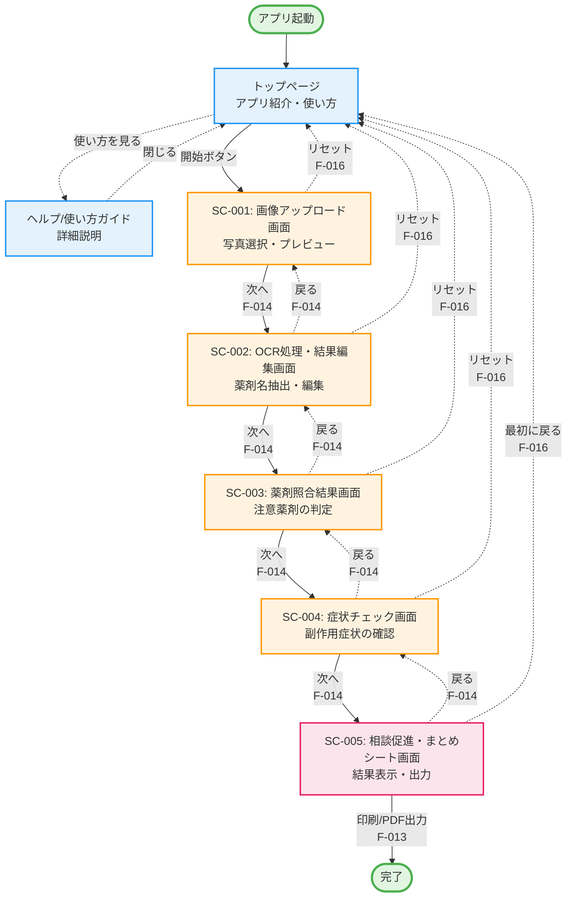

# 画面設計書

## プロジェクト名
**患者参加型・薬の安全チェックアプリ**

---

## 目次
1. [画面一覧](#画面一覧)
2. [画面遷移図](#画面遷移図)
3. [アクセス権限マトリックス](#アクセス権限マトリックス)
4. [ルーティング一覧](#ルーティング一覧)
5. [ミドルウェア設計](#ミドルウェア設計)
6. [エラーハンドリング](#エラーハンドリング)

---

## 画面一覧

### 画面一覧表

| 画面ID | 画面名 | ルート | カテゴリ | 説明 | 関連機能ID |
|--------|--------|--------|----------|------|-----------|
| - | トップページ | `/` | 公開 | アプリ紹介・使い方ガイド・開始ボタン | F-017, F-021 |
| - | ヘルプ/使い方ガイドページ | `/help` | 公開 | ステップバイステップガイド・スクリーンショット例 | F-017, F-018 |
| SC-001 | 画像アップロード画面 | `/upload` | メイン機能 | 画像ファイル選択・ドラッグ&ドロップ・プレビュー | F-001, F-002, F-019, F-020 |
| SC-002 | OCR処理・結果編集画面 | `/ocr` | メイン機能 | OCR処理・薬剤名リスト表示・編集 | F-003, F-004, F-005, F-006 |
| SC-003 | 薬剤照合結果画面 | `/check` | メイン機能 | 薬剤照合・該当/非該当の分類表示 | F-007, F-008 |
| SC-004 | 症状チェック画面 | `/symptoms` | メイン機能 | 副作用症状リスト・チェックボックス | F-009, F-010 |
| SC-005 | 相談促進・まとめシート画面 | `/result` | メイン機能 | 相談促進メッセージ・シート生成・PDF出力 | F-011, F-012, F-013 |

### 画面詳細

#### トップページ（`/`）

**目的**: アプリのエントリーポイント、ユーザーを機能へ誘導

**主要コンポーネント**:
- ヘッダー: アプリ名・ロゴ
- メインビジュアル: アプリ説明（簡潔な3行程度）
- 開始ボタン（大きく目立つデザイン）
- 使い方ガイドボタン
- 免責事項（簡潔版）

**ユーザーアクション**:
- 「チェックを開始」ボタン → `/upload` へ遷移
- 「使い方を見る」ボタン → `/help` へ遷移

---

#### ヘルプ/使い方ガイドページ（`/help`）

**目的**: アプリの使い方を詳しく説明

**主要コンポーネント**:
- ステップバイステップガイド（4ステップ）
  1. お薬手帳の写真を撮影・アップロード
  2. 薬剤名を確認・修正
  3. 注意が必要な薬剤を確認
  4. 気になる症状をチェックして医師に相談
- スクリーンショット例
- よくある質問（FAQ）
- 戻るボタン

**ユーザーアクション**:
- 「戻る」ボタン → `/` へ遷移

---

#### SC-001: 画像アップロード画面（`/upload`）

**目的**: お薬手帳の写真をアップロード

**主要コンポーネント**:
- 画像アップロード領域
  - ファイル選択ボタン
  - ドラッグ&ドロップ領域
  - 対応形式表示（JPEG, PNG）
  - サイズ制限表示（最大10MB）
- 画像プレビュー
  - アップロード後の画像表示
  - 回転・拡大機能（オプション）
- エラーメッセージ表示エリア
- 「次へ」ボタン（画像アップロード後に有効化）
- コンテキストヘルプアイコン

**バリデーション**:
- ファイル形式チェック（JPEG/PNG のみ）
- ファイルサイズチェック（10MB以下）

**ユーザーアクション**:
- 画像アップロード → API: `POST /api/upload`
- 「次へ」ボタン → `/ocr` へ遷移

**関連機能**: F-001, F-002, F-019, F-020, F-021

---

#### SC-002: OCR処理・結果編集画面（`/ocr`）

**目的**: 画像から薬剤名を抽出し、ユーザーが確認・編集

**主要コンポーネント**:
- ローディング表示（OCR処理中）
  - スピナー
  - 処理状況メッセージ
  - 進捗バー
- 抽出結果リスト
  - 薬剤名リスト（編集可能）
  - 追加ボタン
  - 削除ボタン
  - インライン編集機能
- エラーメッセージ表示エリア
- 「戻る」ボタン
- 「次へ」ボタン（薬剤名が1つ以上ある場合に有効化）

**処理フロー**:
1. 画面表示時に自動的にOCR処理開始
2. ローディング表示（5-10秒）
3. 抽出結果表示
4. ユーザーが確認・編集

**バリデーション**:
- 薬剤名の空白チェック
- 最低1つの薬剤名が必要

**ユーザーアクション**:
- 画面表示時 → API: `POST /api/ocr`
- 処理状況確認 → API: `GET /api/ocr/status/{task_id}`
- 薬剤名編集（追加・削除・修正）
- 「戻る」ボタン → `/upload` へ遷移
- 「次へ」ボタン → `/check` へ遷移

**関連機能**: F-003, F-004, F-005, F-006, F-019, F-021

---

#### SC-003: 薬剤照合結果画面（`/check`）

**目的**: 抽出された薬剤を注意薬剤リストと照合し、結果を表示

**主要コンポーネント**:
- 照合結果サマリー
  - 該当薬剤数の表示
  - 非該当薬剤数の表示
- 該当薬剤リスト（ハイライト表示）
  - 薬剤名
  - 注意理由
  - 「詳細を見る」リンク
- 非該当薬剤リスト（通常表示）
  - 薬剤名
- 該当なしメッセージ（該当薬剤がない場合）
- 「戻る」ボタン
- 「次へ」ボタン

**処理フロー**:
1. 画面表示時に自動的に照合処理実行
2. 結果表示

**ユーザーアクション**:
- 画面表示時 → API: `POST /api/drugs/check`
- 「戻る」ボタン → `/ocr` へ遷移
- 「次へ」ボタン → `/symptoms` へ遷移

**関連機能**: F-007, F-008, F-021

**⚠️ 重要**: 非断定表現の使用（「注意が必要とされています」など）

---

#### SC-004: 症状チェック画面（`/symptoms`）

**目的**: 副作用症状を表示し、患者が気になる症状をチェック

**主要コンポーネント**:
- 説明文
  - 「以下の症状で気になるものがあればチェックしてください」
  - 非断定表現の使用
- 症状リスト
  - チェックボックス
  - 症状名
  - 症状の説明（平易な言葉）
  - 詳細説明トグル/モーダル
- 「戻る」ボタン
- 「次へ」ボタン（チェックなしでも進める）

**処理フロー**:
1. 画面表示時に該当薬剤の副作用症状を取得
2. 症状リスト表示
3. ユーザーがチェック

**ユーザーアクション**:
- 画面表示時 → API: `POST /api/drugs/symptoms`
- 症状チェック（複数選択可）
- 「戻る」ボタン → `/check` へ遷移
- 「次へ」ボタン → `/result` へ遷移

**関連機能**: F-009, F-010, F-021

**⚠️ 重要**: 非断定表現の使用（「現れやすいと報告されています」など）

---

#### SC-005: 相談促進・まとめシート画面（`/result`）

**目的**: 相談を促し、医師への相談用シートを提供

**主要コンポーネント**:
- 相談促進メッセージ
  - 症状がチェックされている場合: 「医師・薬剤師にご相談ください」
  - 症状がチェックされていない場合: 「引き続き体調にご注意ください」
  - 免責事項（重要）
  - 服薬中止禁止の明示
- まとめシート表示
  - チェック日時
  - 該当薬剤リスト
  - チェックした症状リスト
  - 相談用メモ欄（印刷時用）
- アクションボタン
  - 「印刷」ボタン
  - 「PDFダウンロード」ボタン
  - 「最初に戻る」ボタン

**処理フロー**:
1. 画面表示時にシート生成
2. シート表示
3. ユーザーが印刷またはPDF出力

**ユーザーアクション**:
- 画面表示時 → API: `POST /api/report/generate`
- 「印刷」ボタン → ブラウザ印刷機能
- 「PDFダウンロード」ボタン → API: `GET /api/report/{id}/pdf`
- 「最初に戻る」ボタン → `/` へ遷移（確認ダイアログ表示）

**関連機能**: F-011, F-012, F-013, F-016, F-021

**⚠️ 法的重要性**: SaMD回避の最重要機能

---

## 画面遷移図

### メイン画面フロー



### 遷移パターン説明

| パターン | 説明 | 表示 | データ保持 |
|---------|------|------|-----------|
| メインフロー（前進） | 次へボタンによる画面遷移 | 実線矢印 | あり（F-015） |
| 戻る | 戻るボタンによる画面遷移 | 点線矢印 | あり（F-015） |
| リセット | 最初に戻る（全データクリア） | 点線矢印 | なし（F-016） |
| ヘルプ表示 | モーダルまたは別ページ | 点線矢印 | 影響なし（F-017） |

---

## アクセス権限マトリックス

### パターン1: 現在の設計（認証なし・全公開）

| 画面ID | 画面名 | ゲスト | 認証済み | 備考 |
|--------|--------|--------|----------|------|
| - | トップページ | ✅ | - | 全ユーザーアクセス可能 |
| - | ヘルプ/使い方ガイド | ✅ | - | 全ユーザーアクセス可能 |
| SC-001 | 画像アップロード画面 | ✅ | - | 全ユーザーアクセス可能 |
| SC-002 | OCR処理・結果編集画面 | ✅ | - | 全ユーザーアクセス可能 |
| SC-003 | 薬剤照合結果画面 | ✅ | - | 全ユーザーアクセス可能 |
| SC-004 | 症状チェック画面 | ✅ | - | 全ユーザーアクセス可能 |
| SC-005 | 相談促進・まとめシート画面 | ✅ | - | 全ユーザーアクセス可能 |

**凡例**: ✅ = アクセス可能、❌ = アクセス不可、- = 該当なし

**認証ステータス**: このアプリは認証機能を持たないため、すべての画面が公開利用可能です。

---

### パターン2: 将来拡張時の提案（認証機能追加）

| 画面ID | 画面名 | ゲスト | 認証済み | 管理者 | 備考 |
|--------|--------|--------|----------|--------|------|
| - | トップページ | ✅ | ✅ | ✅ | 全ユーザーアクセス可能 |
| - | ログイン画面 | ✅ | - | - | 認証済みはリダイレクト |
| - | 新規登録画面 | ✅ | - | - | 認証済みはリダイレクト |
| - | ヘルプ/使い方ガイド | ✅ | ✅ | ✅ | 全ユーザーアクセス可能 |
| SC-001 | 画像アップロード画面 | ⚠️ | ✅ | ✅ | ゲストは制限付き利用 |
| SC-002 | OCR処理・結果編集画面 | ⚠️ | ✅ | ✅ | ゲストは制限付き利用 |
| SC-003 | 薬剤照合結果画面 | ⚠️ | ✅ | ✅ | ゲストは制限付き利用 |
| SC-004 | 症状チェック画面 | ⚠️ | ✅ | ✅ | ゲストは制限付き利用 |
| SC-005 | 相談促進・まとめシート画面 | ⚠️ | ✅ | ✅ | ゲストは制限付き利用 |
| - | マイページ | ❌ | ✅ | ✅ | 認証必須 |
| - | チェック履歴一覧 | ❌ | ✅ | ✅ | 認証必須 |
| - | お気に入り薬剤リスト | ❌ | ✅ | ✅ | 認証必須 |
| - | 管理画面（薬剤データ管理） | ❌ | ❌ | ✅ | 管理者のみ |

**ゲストの制限内容（⚠️）**:
- 1日の利用回数制限（例：5回まで）
- データの保存不可（セッションのみ）
- 履歴閲覧不可
- より厳しいRate Limiting

---

## ルーティング一覧

### フロントエンドルーティング（画面ルート）

| ルート | ルート名 | 画面ID | 画面名 | HTTPメソッド | ミドルウェア | 説明 |
|--------|----------|--------|--------|-------------|-------------|------|
| `/` | home | - | トップページ | GET | `publicRoute`, `securityHeaders` | アプリ紹介・開始ボタン |
| `/help` | help | - | 使い方ガイド | GET | `publicRoute`, `securityHeaders` | 詳細な使い方説明 |
| `/upload` | upload | SC-001 | 画像アップロード画面 | GET | `publicRoute`, `rateLimit`, `securityHeaders` | 写真選択・プレビュー |
| `/ocr` | ocr | SC-002 | OCR処理・結果編集画面 | GET | `publicRoute`, `rateLimit`, `sessionCheck`, `securityHeaders` | 薬剤名抽出・編集 |
| `/check` | check | SC-003 | 薬剤照合結果画面 | GET | `publicRoute`, `sessionCheck`, `securityHeaders` | 注意薬剤の判定表示 |
| `/symptoms` | symptoms | SC-004 | 症状チェック画面 | GET | `publicRoute`, `sessionCheck`, `securityHeaders` | 副作用症状の確認 |
| `/result` | result | SC-005 | 相談促進・まとめシート画面 | GET | `publicRoute`, `sessionCheck`, `securityHeaders` | 結果表示・PDF出力 |

---

### バックエンドルーティング（APIエンドポイント）

| ルート | ルート名 | HTTPメソッド | リクエストBody | レスポンス | ミドルウェア | 関連機能ID | 説明 |
|--------|----------|-------------|---------------|-----------|-------------|-----------|------|
| `/api/health` | health_check | GET | - | `{"status": "ok"}` | - | - | ヘルスチェック |
| `/api/upload` | upload_image | POST | `multipart/form-data` | `{"image_id": "..."}` | `rateLimit`, `fileValidation`, `fileSizeLimit`, `cors` | F-001 | 画像アップロード |
| `/api/images/{image_id}` | get_image | GET | - | 画像データ | `rateLimit`, `cors` | F-002 | 画像取得 |
| `/api/ocr` | process_ocr | POST | `{"image_id": "..."}` | `{"task_id": "..."}` | `rateLimit`, `timeout`, `cors` | F-004 | OCR処理開始 |
| `/api/ocr/status/{task_id}` | ocr_status | GET | - | `{"status": "...", "drugs": [...]}` | `cors` | F-006 | OCR処理状況確認 |
| `/api/drugs/check` | check_drugs | POST | `{"drugs": [...]}` | `{"matched": [...], "unmatched": [...]}` | `rateLimit`, `cors` | F-007 | 薬剤照合 |
| `/api/drugs/symptoms` | get_symptoms | POST | `{"drugs": [...]}` | `{"symptoms": [...]}` | `rateLimit`, `cors` | F-009 | 副作用症状取得 |
| `/api/report/generate` | generate_report | POST | `{"drugs": [...], "symptoms": [...]}` | `{"report_id": "..."}` | `rateLimit`, `cors` | F-012 | まとめシート生成 |
| `/api/report/{report_id}/pdf` | download_pdf | GET | - | PDFファイル | `cors` | F-013 | PDF出力 |
| `/api/drugs` | get_drugs_list | GET | - | `{"drugs": [...]}` | `cache`, `cors` | F-023 | 薬剤リスト取得 |
| `/api/drugs/{drug_id}` | get_drug_detail | GET | - | `{"drug": {...}}` | `cache`, `cors` | F-023 | 薬剤詳細取得 |

---

### 画面とAPIの対応関係

| 画面ID | 画面名 | 使用するAPIエンドポイント |
|--------|--------|------------------------|
| SC-001 | 画像アップロード画面 | `POST /api/upload`<br>`GET /api/images/{image_id}` |
| SC-002 | OCR処理・結果編集画面 | `POST /api/ocr`<br>`GET /api/ocr/status/{task_id}` |
| SC-003 | 薬剤照合結果画面 | `POST /api/drugs/check` |
| SC-004 | 症状チェック画面 | `POST /api/drugs/symptoms` |
| SC-005 | 相談促進・まとめシート画面 | `POST /api/report/generate`<br>`GET /api/report/{report_id}/pdf` |

---

## ミドルウェア設計

### ミドルウェア一覧

| ミドルウェア名 | 適用対象 | 処理内容 | 実装優先度 | 実装場所 |
|--------------|---------|---------|-----------|---------|
| `publicRoute` | 全画面 | アクセス制限なし（誰でもアクセス可能） | Must | フロントエンド |
| `sessionCheck` | SC-002～005 | セッション存在確認、なければトップへリダイレクト | Must | フロントエンド |
| `rateLimit` | API全般 | IP別リクエスト数制限（DDoS対策） | Must | バックエンド |
| `fileValidation` | `/api/upload` | ファイル形式検証（JPEG/PNG のみ） | Must | バックエンド |
| `fileSizeLimit` | `/api/upload` | ファイルサイズ制限（10MB以下） | Must | バックエンド |
| `timeout` | `/api/ocr` | タイムアウト設定（30秒） | Must | バックエンド |
| `cache` | `/api/drugs/*` | レスポンスキャッシュ（24時間） | Should | バックエンド |
| `cors` | 全API | CORS設定（信頼できるドメインのみ許可） | Must | バックエンド |
| `securityHeaders` | 全て | セキュリティヘッダー追加（XSS, Clickjacking対策） | Must | フロントエンド・バックエンド |

---

### ミドルウェア詳細仕様

#### 1. sessionCheck（セッションチェック）

**目的**: 画像アップロード前の画面にアクセスを防ぐ

**動作**:
- セッションまたはLocalStorageに`app_session`の存在を確認
- 存在しない場合はトップページ（`/`）にリダイレクト
- 存在する場合は次の処理へ

**適用画面**: SC-002, SC-003, SC-004, SC-005

**実装例**:
```typescript
// middleware.ts (Next.js)
const SESSION_REQUIRED_ROUTES = ['/ocr', '/check', '/symptoms', '/result'];

if (SESSION_REQUIRED_ROUTES.includes(pathname)) {
  const hasSession = request.cookies.get('app_session');
  if (!hasSession) {
    return NextResponse.redirect(new URL('/', request.url));
  }
}
```

---

#### 2. rateLimit（レート制限）

**目的**: DDoS攻撃防止、サーバー負荷軽減

**動作**:
- IPアドレス別にリクエスト数をカウント
- 制限を超えた場合は`429 Too Many Requests`を返す

**制限値**:
- 画像アップロード: 10回/分
- OCR処理: 5回/分
- その他のAPI: 30回/分

**実装例**:
```python
# main.py (FastAPI)
from slowapi import Limiter
from slowapi.util import get_remote_address

limiter = Limiter(key_func=get_remote_address)

@app.post("/api/upload")
@limiter.limit("10/minute")
async def upload_image(...):
    ...
```

---

#### 3. fileValidation（ファイル検証）

**目的**: 不正なファイルのアップロード防止

**動作**:
- ファイルのContent-Typeをチェック
- `image/jpeg` または `image/png` のみ許可
- 不正な場合は`415 Unsupported Media Type`を返す

**実装例**:
```python
if file.content_type not in ["image/jpeg", "image/png"]:
    raise HTTPException(
        status_code=415,
        detail="対応していない画像形式です。JPEG または PNG をアップロードしてください。"
    )
```

---

#### 4. fileSizeLimit（ファイルサイズ制限）

**目的**: 大容量ファイルによるサーバー負荷防止

**動作**:
- ファイルサイズをチェック
- 10MB以下のみ許可
- 超過した場合は`413 Payload Too Large`を返す

**実装例**:
```python
MAX_SIZE = 10 * 1024 * 1024  # 10MB
if file_size > MAX_SIZE:
    raise HTTPException(
        status_code=413,
        detail="ファイルサイズが大きすぎます。10MB以下にしてください。"
    )
```

---

#### 5. securityHeaders（セキュリティヘッダー）

**目的**: XSS、Clickjacking、MIME Sniffing攻撃防止

**動作**:
- 各種セキュリティヘッダーをレスポンスに追加

**追加ヘッダー**:
- `X-Frame-Options: DENY`
- `X-Content-Type-Options: nosniff`
- `X-XSS-Protection: 1; mode=block`
- `Referrer-Policy: strict-origin-when-cross-origin`

**実装例**:
```typescript
// middleware.ts (Next.js)
const response = NextResponse.next();
response.headers.set('X-Frame-Options', 'DENY');
response.headers.set('X-Content-Type-Options', 'nosniff');
response.headers.set('X-XSS-Protection', '1; mode=block');
response.headers.set('Referrer-Policy', 'strict-origin-when-cross-origin');
```

---

## エラーハンドリング

### HTTPステータスコード一覧

| コード | 意味 | 使用場面 | ユーザー向けメッセージ |
|--------|------|---------|---------------------|
| 200 | OK | 正常処理完了 | - |
| 400 | Bad Request | バリデーションエラー | 「入力内容に誤りがあります」 |
| 413 | Payload Too Large | ファイルサイズ超過 | 「ファイルサイズが大きすぎます（最大10MB）」 |
| 415 | Unsupported Media Type | 非対応ファイル形式 | 「対応していない画像形式です。JPEG または PNG をアップロードしてください」 |
| 429 | Too Many Requests | Rate Limit超過 | 「しばらく時間をおいてから再度お試しください」 |
| 500 | Internal Server Error | サーバーエラー | 「エラーが発生しました。もう一度お試しください」 |
| 504 | Gateway Timeout | OCRタイムアウト | 「処理に時間がかかりすぎています。もう一度お試しください」 |

---

### 画面別エラーハンドリング

#### SC-001: 画像アップロード画面

| エラー条件 | HTTPステータス | 表示メッセージ | リカバリー方法 |
|-----------|---------------|---------------|--------------|
| 非対応ファイル形式 | 415 | 「対応していない画像形式です。JPEG または PNG をアップロードしてください」 | 正しい形式のファイルを選択 |
| ファイルサイズ超過 | 413 | 「ファイルサイズが大きすぎます。10MB以下にしてください」 | サイズの小さいファイルを選択 |
| アップロード失敗 | 500 | 「画像のアップロードに失敗しました。もう一度お試しください」 | 再アップロード |

#### SC-002: OCR処理・結果編集画面

| エラー条件 | HTTPステータス | 表示メッセージ | リカバリー方法 |
|-----------|---------------|---------------|--------------|
| OCR処理失敗 | 500 | 「文字の読み取りに失敗しました。画像を変えてお試しください」 | 画面を戻って別の画像をアップロード |
| OCRタイムアウト | 504 | 「処理に時間がかかりすぎています。もう一度お試しください」 | リトライ |
| 薬剤名が空白 | 400 | 「薬剤名を入力してください」 | 薬剤名を入力 |
| 薬剤名が0件 | 400 | 「最低1つの薬剤名が必要です」 | 薬剤名を追加 |

#### SC-003: 薬剤照合結果画面

| エラー条件 | HTTPステータス | 表示メッセージ | リカバリー方法 |
|-----------|---------------|---------------|--------------|
| 照合処理失敗 | 500 | 「照合処理に失敗しました。もう一度お試しください」 | リトライ |
| データ取得失敗 | 500 | 「データの取得に失敗しました。もう一度お試しください」 | リトライ |

#### SC-004: 症状チェック画面

| エラー条件 | HTTPステータス | 表示メッセージ | リカバリー方法 |
|-----------|---------------|---------------|--------------|
| 症状データ取得失敗 | 500 | 「症状データの取得に失敗しました。もう一度お試しください」 | リトライ |

#### SC-005: 相談促進・まとめシート画面

| エラー条件 | HTTPステータス | 表示メッセージ | リカバリー方法 |
|-----------|---------------|---------------|--------------|
| シート生成失敗 | 500 | 「シートの生成に失敗しました。もう一度お試しください」 | リトライ |
| PDF生成失敗 | 500 | 「PDFの生成に失敗しました。印刷機能をお試しください」 | 印刷機能を利用 |

---

### エラー表示方法

#### トースト通知（優先）

**使用場面**: API エラー、バリデーションエラー

**表示位置**: 画面上部中央

**表示時間**: 5秒（自動消滅）

**デザイン**:
- エラー: 赤色背景、白文字
- 警告: 黄色背景、黒文字
- 成功: 緑色背景、白文字

**実装例**:
```typescript
// React Toastify を使用
import { toast } from 'react-toastify';

toast.error('ファイルサイズが大きすぎます（最大10MB）', {
  position: 'top-center',
  autoClose: 5000,
  hideProgressBar: false,
});
```

---

#### インラインエラー表示

**使用場面**: フォームバリデーションエラー

**表示位置**: 該当フィールドの下

**デザイン**: 赤文字、小さめのフォント

**実装例**:
```tsx
{errors.drugName && (
  <p className="text-red-600 text-sm mt-1">
    薬剤名を入力してください
  </p>
)}
```

---

## UI/UX要件（F-021: 高齢者向けUI）

### デザイン原則

| 項目 | 要件 | 基準 |
|-----|------|------|
| フォントサイズ | 最小18px、推奨20px以上 | WCAG 2.1準拠 |
| コントラスト比 | 4.5:1以上 | WCAG 2.1 AA準拠 |
| ボタンサイズ | 最小44×44px | タッチターゲットサイズ |
| タップ可能領域 | 最小48×48px | WCAG 2.1準拠 |
| 余白 | 十分な余白（最小16px） | 視認性向上 |
| レイアウト | シンプルで直感的 | 認知負荷軽減 |

---

### カラーパレット（提案）

| 用途 | カラー | 16進数 | 説明 |
|-----|--------|--------|------|
| プライマリ | 青 | `#2196F3` | メインボタン、リンク |
| セカンダリ | グレー | `#757575` | 通常テキスト |
| 成功 | 緑 | `#4CAF50` | 成功メッセージ |
| 警告 | 黄色 | `#FFC107` | 警告メッセージ |
| エラー | 赤 | `#F44336` | エラーメッセージ |
| 該当薬剤ハイライト | オレンジ | `#FF9800` | 注意薬剤の強調表示 |
| 背景 | 白 | `#FFFFFF` | 背景色 |
| 枠線 | ライトグレー | `#E0E0E0` | ボーダー |

---

### コンポーネントデザイン

#### ボタン

**スタイル**:
- 最小サイズ: 44×44px
- パディング: 16px 32px
- フォントサイズ: 18px
- ボーダーラジウス: 8px
- ホバー効果: 明度変化

**種類**:
- プライマリボタン: 青背景、白文字
- セカンダリボタン: グレー背景、黒文字
- 危険ボタン: 赤背景、白文字（リセット時）

---

#### フォーム入力

**スタイル**:
- 最小高さ: 48px
- パディング: 12px 16px
- フォントサイズ: 18px
- ボーダー: 2px solid グレー
- フォーカス時: 青ボーダー

---

#### チェックボックス

**スタイル**:
- サイズ: 24×24px
- ラベルとの間隔: 12px
- ラベルフォントサイズ: 18px

---

## 関連ドキュメント

- [要件定義書](requirements.md)
- [ユーザーストーリー一覧](user_stories.md)
- [機能一覧表](features.md)
- 技術設計書（未作成）
- データ仕様書（未作成）
- API仕様書（未作成）

---

**文書ステータス**: ドラフト  
**最終更新日**: 2026-01-24  
**作成者**: 開発チーム  
**バージョン**: 1.0.0
